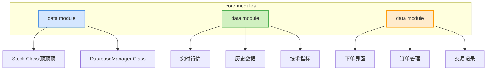
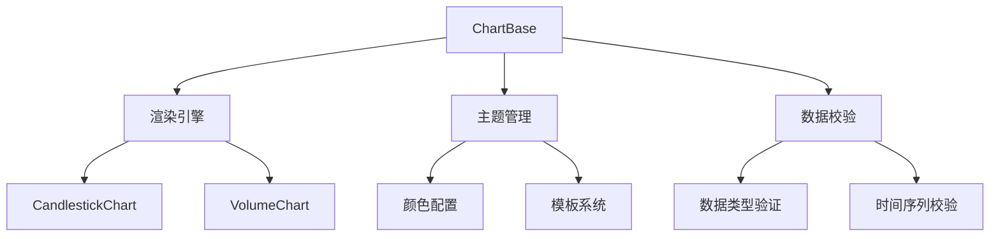

# 1. 量化交易系统项目
## 1.1. 项目概述
本项目是基于streamlit开发的量化交易系统,分为几个模块。
## 1.2. 项目文件夹路径
C:\Users\Thomas P Gao\Documents\personal\VSC\awesome-Qsys
## 1.3. 文件结构
awesome-Qsys/src/
├── frontend/                     # 前端模块
│   ├── backtesting.py            # 回测界面
│   ├── history.py                # 历史行情界面
│   ├── setting.py                # 设置界面
│   ├── indicators.py             # 指标界面
│   ├── trading.py                # 交易管理界面
├── backend/                      # 后端模块
│   ├── api/                      # API接口
├── core/                         # 核心模块
│   ├── data/                     # 数据模块
│   │   ├── database.py           # 股票数据管理
│   │   ├── baostock_source.py
│   │   ├── data_source.py
│   ├── execution/                # 执行模块
│   │   ├── Trader.py             # 交易执行
│   │   ├── TradeDatabaseManager.py # 交易数据管理
│   ├── risk/                     # 风险模块
│   ├── strategy/                 # 策略模块
│   │   ├── strategy.py
│   ├── backtest.py               # 回测引擎
├── services/                 # 服务模块
│   ├── chart_service.py                 # 图表管理服务
│   ├── interaction_service.py                 # 图表关联
│   ├── progress_service.py                 # 进度条
│   ├── stock_search.py                 # 股票搜索
│   ├── theme_manager.py                 # 主题管理
├── notification/                 # 通知模块
├── support/                      # 支持模块
├── venvQuant/                    # 虚拟环境文件夹
├── database.log                  # 数据库日志
├── main.py                       # 项目主函数文件
├── myimports.py                  # 自定义导入

# 2. 核心模块设计
## 2.1. 数据模块 core/data/
功能：
- 通过baostock获取数据市场，同时还支持多种数据源接入。
- 通过PostgreSQL数据库进行数据存储和查询
- 通过_transform_data预处理数据


[Data Sources] → [Data Manager] → [Indicator Calculators]
       ↑                ↓
[Data Service] ← [Cache Layer]

### 2.1.2. Stock类
功能：封装股票实体，提供面向对象的访问方式
```python
# 使用示例
db = DatabaseManager()
stock = db.get_stock("600000")
print(f"{stock.name} 上市时间：{stock.ipo_date}")
```
### 2.1.3. BaostockDataSource类
功能：封装Baostock数据获取逻辑，支持异步数据加载和缓存


#### 2.1.2.1. 核心方法：
- `load_data(symbol, start_date, end_date, frequency)`: 异步加载股票数据
- `_transform_data(data)`: 标准化数据格式

#### 2.1.2.2. 数据库表结构
- StockData: 存储股票历史数据
  - id: 主键
  - symbol: 股票代码
  - date: 日期时间
  - open: 开盘价
  - high: 最高价
  - low: 最低价
  - close: 收盘价
  - volume: 成交量
  - frequency: 数据频率

### 2.1.2.3. DatabaseManager类
```python
class DatabaseManager:
    """
    数据库管理类，负责与PostgreSQL数据库的交互
    """
    def __init__(self, host='113.45.40.20', port=8080, dbname='quantdb', 
                 user='quant', password='quant123', admin_db='quantdb'):
        """
        初始化数据库连接配置
        :param host: 数据库主机地址
        :param port: 数据库端口
        :param dbname: 数据库名称
        :param user: 用户名
        :param password: 密码
        :param admin_db: 管理数据库名称
        """

#### 1.4.3.3. 特性说明：
1. 异步数据加载：
   - 支持异步加载股票数据，提高系统响应速度
   - 自动检查并补充缺失数据
   
2. 数据完整性检查：
   - 精确计算缺失日期范围
   - 支持跨日期范围的数据完整性验证

3. 日志记录：
   - 详细记录每个操作步骤
   - 支持错误日志和调试信息

4. 错误处理：
   - 增强的异常处理机制
   - 自动回滚失败的事务

#### 1.4.3.4. 核心方法：

1. `init_db() -> None`
   - 功能：初始化数据库表结构
   - 参数：无
   - 返回：无

2. `save_stock_data(data: pd.DataFrame, symbol: str, frequency: str) -> bool`
   - 功能：保存股票数据到数据库
   - 参数：
     - data: 包含股票数据的DataFrame
     - symbol: 股票代码
     - frequency: 数据频率（如"5"表示5分钟数据）
   - 返回：保存是否成功

3. `async load_stock_data(symbol: str, start_date: str, end_date: str, frequency: str) -> pd.DataFrame`
   - 功能：从数据库异步加载股票数据
   - 参数：
     - symbol: 股票代码
     - start_date: 开始日期
     - end_date: 结束日期
     - frequency: 数据频率
   - 返回：包含股票数据的DataFrame

4. `check_data_completeness(symbol: str, start_date: str, end_date: str) -> list[tuple[str, str]]`
   - 功能：检查数据完整性并返回缺失日期范围
   - 参数：
     - symbol: 股票代码
     - start_date: 开始日期
     - end_date: 结束日期
   - 返回：缺失日期范围列表，每个元素为(start_date, end_date)元组


#### 1.4.3.4. 使用示例：
```python
# 初始化数据库
db_manager = DatabaseManager()
db_manager.init_db()

# 保存数据
success = db_manager.save_stock_data(df, "sh.600622", "5")

# 查询数据
df = db_manager.load_stock_data("sh.600622", "2025-03-01", "2025-03-25", "5")
```

### Stock类

### 2.1.3. 数据获取流程
1. 检查内存缓存
2. 检查磁盘缓存
3. 从数据库获取数据
4. 从Baostock API获取数据
5. 缓存新数据
6. 更新数据库表数据

### 2.1.4. 数据库表
- Market_Data
- Trade_Records
- Positions
- Strategies
- Signals
- Accounts
- Fund_Flows
- Backtest_Results
- Risk_Management
- Logs

### 2.1.5. 数据格式标准化
- 统一时间字段格式
- 统一列名命名规范
- 处理缺失值和异常值

## 2.2. 策略模块 core/strategy/
功能：定义和管理交易策略。
子模块：
策略模板：提供策略开发的基类和接口。
策略市场：存储和管理用户创建的策略。
策略回测：支持策略的历史回测功能。

## 2.3. 交易模块 core/execute/
功能：负责交易订单的生成和执行。
子模块：
订单管理：创建、修改、取消订单。通过OrderManager类提供RESTful API接口
执行引擎：对接交易所 API，执行交易。实现与交易所API的对接，支持异步订单执行
交易记录：记录所有交易细节。将交易数据持久化到数据库，提供查询接口


### 2.3.1. OrderManager 订单管理类
负责订单的创建、修改、取消
主要方法：create_order(), modify_order(), cancel_order()
### 2.3.2. ExecutionEngine 执行引擎类
负责与交易所API的对接和订单执行
主要方法：execute_order(), cancel_execution()
- format_for_ths(): 格式化指令以适应交易所(同花顺)

### 2.3.3. TradeRecorder 交易记录类
负责记录所有交易细节
主要方法：record_trade(), query_trades()
### 2.3.4. 数据库表设计：
Orders 订单表
- order_id (主键)
- symbol 标的代码
- order_type 订单类型 (市价/限价)
- quantity 数量
- price 价格
- status 状态 (新建/已提交/已完成/已取消)
- create_time 创建时间
- update_time 更新时间

Executions 执行表
- execution_id (主键)
- order_id (外键)
- exec_price 执行价格
- exec_quantity 执行数量
- exec_time 执行时间
- status 执行状态 (成功/失败)

TradeHistory 交易历史表

- trade_id (主键)
- symbol 标的代码
- trade_time 交易时间
- trade_price 交易价格
- trade_quantity 交易数量
- trade_type 交易类型 (买入/卖出)


## 2.4. 风险模块 core/risk/
功能：监控和管理交易风险。
子模块：
风险评估：计算风险指标（如 VaR、最大回撤等）。
风险控制：设置止损、止盈等规则。
风险报告：生成风险报告和警报。
# 3. 前端模块
## 3.1. 2.1 用户界面模块
功能：提供用户交互界面。
子模块：
仪表盘：展示关键指标和市场概况。
策略管理：允许用户创建、编辑和监控策略。
交易执行：提供交易订单的界面。
风险监控：展示风险指标和警报。
历史行情：
  - 支持手动刷新股票列表
  - 异步加载历史数据
  - 数据加载进度提示

## 2.5 回测模块 core/backtest/
示例用法：
```python
# 创建配置实例
config = BacktestConfig(
    start_date="2020-01-01",
    end_date="2023-01-01",
    target_symbol="000300.SH",
    monthly_investment=1000,
    stop_loss=0.05,
    take_profit=0.1
)

# 序列化为JSON
config_json = config.to_json()

# 从JSON反序列化
new_config = BacktestConfig.from_json(config_json)
```


## 3.2. 2.2 数据可视化模块
功能：将数据和交易结果以可视化形式展示。

### 最新功能：
- 主题管理系统（暗黑/明亮模式切换）
- 动态控件配置（均线周期/成交量颜色自定义）
- 多图表联动缩放
- 数据完整性验证模块
- 响应式布局支持

### 技术架构：


### 可视化组件：
1. K线图系统
   - 支持MA/SMA/EMA等均线类型
   - 布林带/通道线绘制
   - 分时图/蜡烛图切换

2. 成交量图表
   - 涨跌颜色自定义
   - 量价联动分析
   - 滚动平均成交量

3. 指标分析图
   - MACD/RSI/KDJ 等指标
   - 多周期对比
   - 自定义指标公式
## 3.3. 2.3 实时通信模块
功能：支持前端与后端的实时数据通信。
子模块：
WebSocket：处理实时市场数据和交易更新。
REST API：处理非实时请求。
# 4. 后端模块
## 4.1. 3.1 API 网关
功能：作为前端与核心模块之间的桥梁。
子模块：
路由管理：定义 API 路由。
请求处理：解析和处理前端请求。
响应格式化：将后端数据格式化为前端可读的格式。
## 4.2. 3.2 任务调度模块
功能：管理定时任务和异步任务。
子模块：
定时任务：如定期获取市场数据、更新策略等。
异步任务：如处理大量计算任务。
## 4.3. 3.3 认证授权模块
功能：管理用户认证和权限控制。
子模块：
用户认证：处理登录、注册等。
权限控制：定义用户角色和权限。
# 5. 支持模块
## 5.1. 4.1 日志模块
功能：记录系统运行日志和交易日志。
子模块：
日志记录：存储日志信息。
日志查询：提供日志查询接口。
## 5.2. 4.2 监控模块
功能：监控系统性能和状态。
子模块：
性能监控：监控 CPU、内存等资源使用情况。
健康检查：提供系统健康状态检查接口。
## 5.3. 4.3 通知模块
功能：发送通知和警报。
子模块：
邮件通知：发送交易确认、风险警报等邮件。
站内通知：提供站内消息系统。


## 5.4. 数据库部署

### 5.4.1. 使用docker-compose部署

1. 确保已安装Docker和docker-compose
2. 在项目根目录执行以下命令启动服务：
```bash
docker-compose up -d
```

### 5.4.2. 服务信息

#### 5.4.2.1. PostgreSQL数据库
- 访问地址：localhost:5432
- 用户名：quant
- 密码：quant123
- 数据库名称：quantdb

#### 5.4.2.2. pgAdmin管理界面
- 访问地址：http://localhost:8080
- 登录邮箱：admin@quant.com
- 登录密码：admin123

### 5.4.3. 环境变量（可选）
可以在docker-compose.yml中修改以下环境变量：
- POSTGRES_USER：数据库用户名
- POSTGRES_PASSWORD：数据库密码
- POSTGRES_DB：数据库名称
- PGADMIN_DEFAULT_EMAIL：pgAdmin登录邮箱
- PGADMIN_DEFAULT_PASSWORD：pgAdmin登录密码

# 6. 待更新
- [x] 实现手动刷新功能
- [x] 优化异步数据加载
- [ ] 仔细检查回测思路
- [x] 买卖点绘制
- [ ] hover 参数
