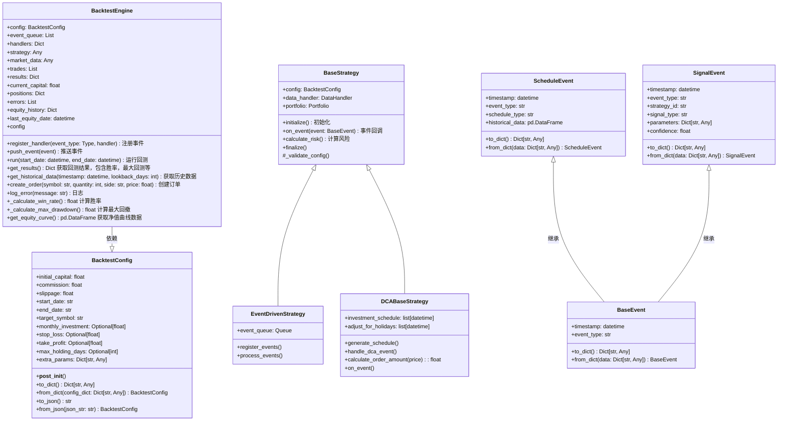
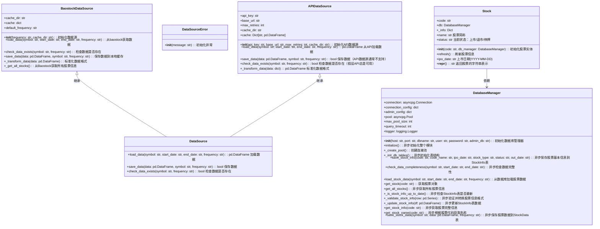
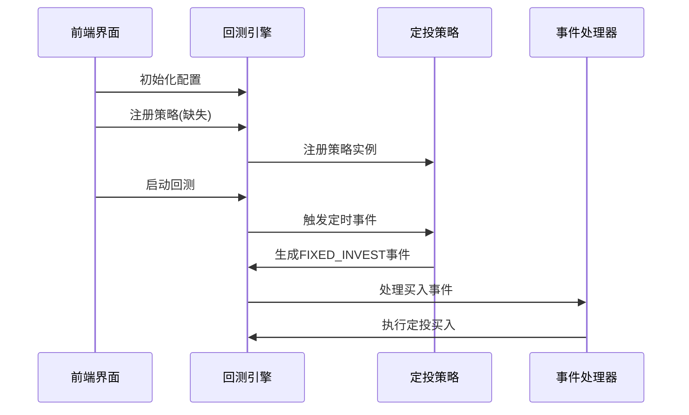

# 类与方法

```mermaid
classDiagram
    class BacktestConfig {
        +initial_capital: float
        +commission: float
        +slippage: float
        +start_date: str
        +end_date: str
        +target_symbol: str
        +monthly_investment: Optional[float]
        +stop_loss: Optional[float]
        +take_profit: Optional[float]
        +max_holding_days: Optional[int]
        +extra_params: Dict[str, Any]
        +__post_init__()
        +to_dict() Dict[str, Any]
        +from_dict(config_dict: Dict[str, Any]) BacktestConfig
        +to_json() str
        +from_json(json_str: str) BacktestConfig
    }
    class BacktestEngine {
        +config: BacktestConfig
        +event_queue: List
        +handlers: Dict
        +strategy: Any
        +market_data: Any
        +trades: List
        +results: Dict
        +current_capital: float
        +positions: Dict
        +errors: List
        +equity_history: Dict
        +last_equity_date: datetime
        +register_handler(event_type: Type, handler) 注册事件
        +push_event(event) 推送事件
        +run(start_date: datetime, end_date: datetime) 运行回测
        +get_results() Dict 获取回测结果，包含胜率，最大回测等
        +get_historical_data(timestamp: datetime, lookback_days: int) 获取历史数据
        +create_order(symbol: str, quantity: int, side: str, price: float) 创建订单
        +log_error(message: str) 日志
        +_calculate_win_rate() float 计算胜率
        +_calculate_max_drawdown() float 计算最大回撤
        +get_equity_curve() pd.DataFrame 获取净值曲线数据
    }
    class BaseStrategy {
        +config: BacktestConfig
        +data_handler: DataHandler
        +portfolio: Portfolio
        +initialize() 初始化
        +on_event(event: BaseEvent) 事件回调
        +calculate_risk() 计算风险
        +finalize() 
        #_validate_config()
    }
    
    
    class BaseEvent {
        +timestamp: datetime
        +event_type: str
        +to_dict() Dict[str, Any]
        +from_dict(data: Dict[str, Any]) BaseEvent
    }

    class ScheduleEvent {
        +timestamp: datetime
        +event_type: str
        +schedule_type: str
        +historical_data: pd.DataFrame
        +to_dict() Dict[str, Any]
        +from_dict(data: Dict[str, Any]) ScheduleEvent
    }

    class SignalEvent {
        +timestamp: datetime
        +event_type: str
        +strategy_id: str
        +signal_type: str
        +parameters: Dict[str, Any]
        +confidence: float
        +to_dict() Dict[str, Any]
        +from_dict(data: Dict[str, Any]) SignalEvent
    }

    ScheduleEvent <|-- BaseEvent : 继承
    SignalEvent <|-- BaseEvent : 继承


    class EventDrivenStrategy {
        +event_queue: Queue
        +register_events()
        +process_events()
    }
    class DCABaseStrategy {
        +investment_schedule: list[datetime]
        +generate_schedule()
        +handle_dca_event()
        +adjust_for_holidays: list[datetime]
        +calculate_order_amount(price): float
        +on_event()
    }

    BaseStrategy <|-- EventDrivenStrategy
    BaseStrategy <|-- DCABaseStrategy
    BacktestEngine --|> BacktestConfig : 依赖
    BacktestEngine : +config

```

# 核心-数据模块

```mermaid
classDiagram
    class BaostockDataSource {
        +cache_dir: str
        +cache: dict
        +default_frequency: str
        +__init__(frequency: str, cache_dir: str): 初始化数据源
        +load_data(symbol: str, start_date: str, end_date: str, frequency: str): 从baostock获取数据
        +check_data_exists(symbol: str, frequency: str): 检查数据是否存在
        +save_data(data: pd.DataFrame, symbol: str, frequency: str): 保存数据到本地缓存
        +_transform_data(data: pd.DataFrame): 标准化数据格式
        +_get_all_stocks(): 从Baostock获取所有股票信息
    }

    BaostockDataSource <|-- DataSource : 继承

    class DataSourceError {
        +__init__(message: str): 初始化异常
    }

    class DataSource {
        +load_data(symbol: str, start_date: str, end_date: str, frequency: str): pd.DataFrame 加载数据
        +save_data(data: pd.DataFrame, symbol: str, frequency: str): bool 保存数据
        +check_data_exists(symbol: str, frequency: str): bool 检查数据是否存在
    }

    class APIDataSource {
        +api_key: str
        +base_url: str
        +max_retries: int
        +cache_dir: str
        +cache: Dict[str, pd.DataFrame]
        
        +__init__(api_key: str, base_url: str, max_retries: int, cache_dir: str): 初始化API数据源
        +load_data(symbol: str, start_date: str, end_date: str, frequency: str): pd.DataFrame 从API加载数据
        +save_data(data: pd.DataFrame, symbol: str, frequency: str): bool 保存数据（API数据源通常不支持）
        +check_data_exists(symbol: str, frequency: str): bool 检查数据是否存在（假设API总是可用）
        +_transform_data(data: dict): pd.DataFrame 标准化数据格式
    }

    APIDataSource <|-- DataSource : 继承

    class DatabaseManager {
        +connection: asyncpg.Connection
        +connection_config: dict
        +admin_config: dict
        +pool: asyncpg.Pool
        +max_pool_size: int
        +query_timeout: int
        +logger: logging.Logger

        +__init__(host: str, port: str, dbname: str, user: str, password: str, admin_db: str): 初始化数据库管理器
        +initialize(): 异步初始化整个模块
        +_create_pool(): 创建连接池
        +_init_db_tables(): 异步初始化表结构
        +save_stock_info(code: str, code_name: str, ipo_date: str, stock_type: str, status: str, out_date: str): 异步保存股票基本信息到StockInfo表
        +check_data_completeness(symbol: str, start_date: str, end_date: str): 异步检查数据完整性
        +load_stock_data(symbol: str, start_date: str, end_date: str, frequency: str): 从数据库加载股票数据
        +get_stock(code: str): 获取股票对象
        +get_all_stocks(): 异步获取所有股票信息
        +_is_stock_info_up_to_date(): 异步检查StockInfo表是否最新
        +_validate_stock_info(row: pd.Series): 异步验证并转换股票信息格式
        +_update_stock_info(df: pd.DataFrame): 异步更新StockInfo表数据
        +get_stock_info(code: str): 异步获取股票完整信息
        +get_stock_name(code: str): 异步根据股票代码获取名称
        +save_stock_data(symbol: str, data: pd.DataFrame, frequency: str): 异步保存股票数据到StockData表
    }

    class Stock {
        +code: str
        +db: DatabaseManager
        +_info: Dict

        +__init__(code: str, db_manager: DatabaseManager): 初始化股票实体
        +refresh(): 刷新股票信息
        +name: str 股票简称
        +ipo_date: str 上市日期 (YYYY-MM-DD)
        +status: str 当前状态：上市/退市/停牌
        +__repr__(): str 返回股票的字符串表示
    }
    Stock --> DatabaseManager : 依赖


```
# 回测逻辑

```mermaid
sequenceDiagram
    participant Frontend as 前端界面
    participant Engine as 回测引擎
    participant Strategy as 定投策略
    participant Handler as 事件处理器

    Frontend->>Engine: 初始化配置
    Frontend->>Engine: 注册策略(缺失)
    Engine->>Strategy: 注册策略实例
    Frontend->>Engine: 启动回测
    Engine->>Strategy: 触发定时事件
    Strategy->>Engine: 生成FIXED_INVEST事件
    Engine->>Handler: 处理买入事件
    Handler->>Engine: 执行定投买入

```