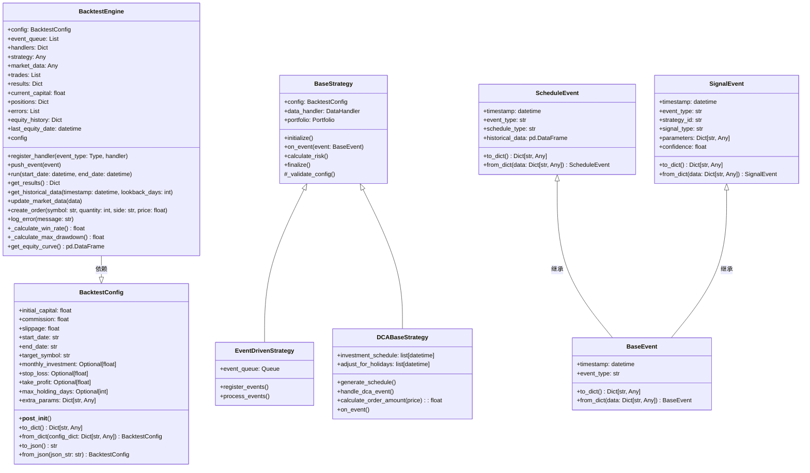

```mermaid
classDiagram
    class BacktestConfig {
        +initial_capital: float
        +commission: float
        +slippage: float
        +start_date: str
        +end_date: str
        +target_symbol: str
        +monthly_investment: Optional[float]
        +stop_loss: Optional[float]
        +take_profit: Optional[float]
        +max_holding_days: Optional[int]
        +extra_params: Dict[str, Any]
        +__post_init__()
        +to_dict() Dict[str, Any]
        +from_dict(config_dict: Dict[str, Any]) BacktestConfig
        +to_json() str
        +from_json(json_str: str) BacktestConfig
    }
    class BacktestEngine {
        +config: BacktestConfig
        +event_queue: List
        +handlers: Dict
        +strategy: Any
        +market_data: Any
        +trades: List
        +results: Dict
        +current_capital: float
        +positions: Dict
        +errors: List
        +equity_history: Dict
        +last_equity_date: datetime
        +register_handler(event_type: Type, handler)
        +push_event(event)
        +run(start_date: datetime, end_date: datetime)
        +get_results() Dict
        +get_historical_data(timestamp: datetime, lookback_days: int)
        +update_market_data(data)
        +create_order(symbol: str, quantity: int, side: str, price: float)
        +log_error(message: str)
        +_calculate_win_rate() float
        +_calculate_max_drawdown() float
        +get_equity_curve() pd.DataFrame
    }
    class BaseStrategy {
        +config: BacktestConfig
        +data_handler: DataHandler
        +portfolio: Portfolio
        +initialize()
        +on_event(event: BaseEvent)
        +calculate_risk()
        +finalize()
        #_validate_config()
    }
    
    
    class BaseEvent {
        +timestamp: datetime
        +event_type: str
        +to_dict() Dict[str, Any]
        +from_dict(data: Dict[str, Any]) BaseEvent
    }

    class ScheduleEvent {
        +timestamp: datetime
        +event_type: str
        +schedule_type: str
        +historical_data: pd.DataFrame
        +to_dict() Dict[str, Any]
        +from_dict(data: Dict[str, Any]) ScheduleEvent
    }

    class SignalEvent {
        +timestamp: datetime
        +event_type: str
        +strategy_id: str
        +signal_type: str
        +parameters: Dict[str, Any]
        +confidence: float
        +to_dict() Dict[str, Any]
        +from_dict(data: Dict[str, Any]) SignalEvent
    }

    ScheduleEvent <|-- BaseEvent : 继承
    SignalEvent <|-- BaseEvent : 继承


    class EventDrivenStrategy {
        +event_queue: Queue
        +register_events()
        +process_events()
    }
    class DCABaseStrategy {
        +investment_schedule: list[datetime]
        +generate_schedule()
        +handle_dca_event()
        +adjust_for_holidays: list[datetime]
        +calculate_order_amount(price): float
        +on_event()
    }

    BaseStrategy <|-- EventDrivenStrategy
    BaseStrategy <|-- DCABaseStrategy
    BacktestEngine --|> BacktestConfig : 依赖
    BacktestEngine : +config

```