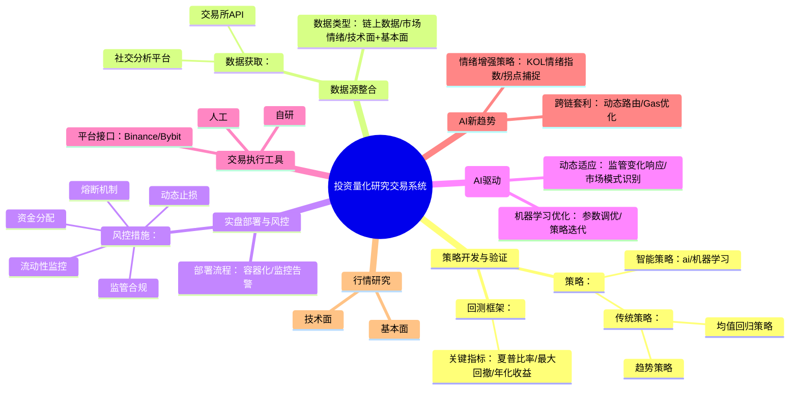

# 投资量化研究交易系统设计框架

## 系统模块架构

## 数据生命周期视角

## 模块说明
1. **策略开发与验证**  
   - 定义交易策略类型和验证方法
   - 通过回测工具验证盈利潜力与稳定性

2. **数据源整合**  
   - 聚合多维度市场数据
   - 支持实时数据流处理

3. **实盘部署与风控**  
   - 实施多层次风险控制
   - 支持容器化弹性部署

4. **持续优化**  
   - 基于机器学习的参数优化
   - 动态适应市场变化

5. **平台架构**  
   - 支持多类型量化平台集成
   - 专注AI驱动的高频套利方案