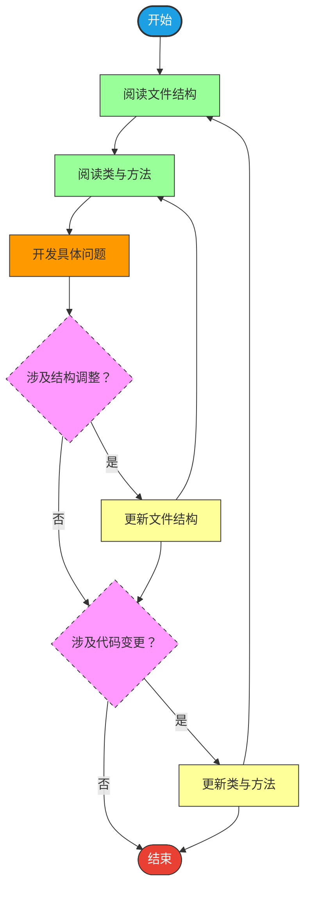

# 启动应用
.\venvWin\Scripts\activate
source 

cd .\src\
streamlit run main.py

# 创建任务
@/docs/system-design/文件结构.md 我正在开发一个量化交易系统，由于数据模块(core/data)涉及多个外部api数据接口，是否建议使用工厂(factory)的设计，我原本的打算是一个api接口建立一个类，如baostock_source.py就对应baostock数据源

# git prompt
请参考模板 /Users/gaogao/Documents/vsc_work/awesome-Qsys/.github/ISSUE_TEMPLATE/开发任务管理.md 写开发任务并调用github mcp server 发布到ISSUE

# 安装依赖
pip install xxx -i https://mirrors.aliyun.com/pypi/simple/

# 重新部署单个容器
docker-compose stop **web** && docker-compose rm -f **web** && docker-compose up -d --force-recreate --build **web**

docker-compose down && docker-compose up --build  -d

# 

