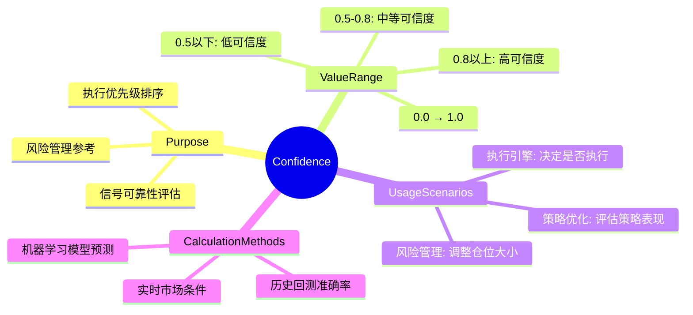
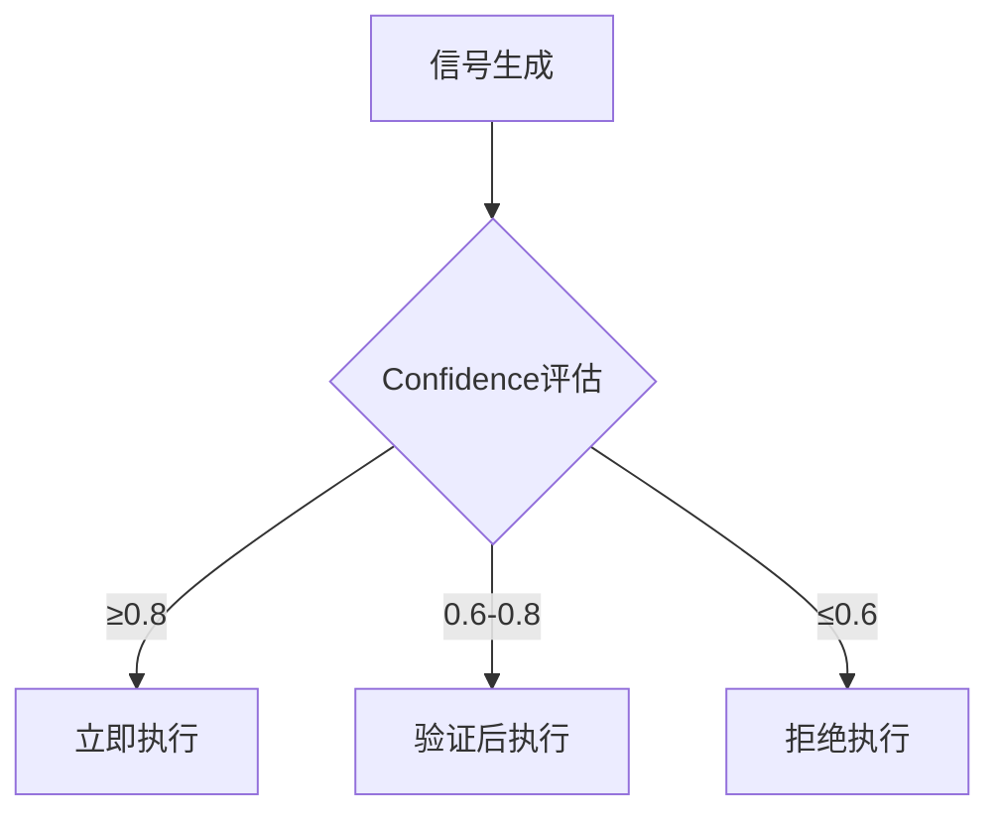
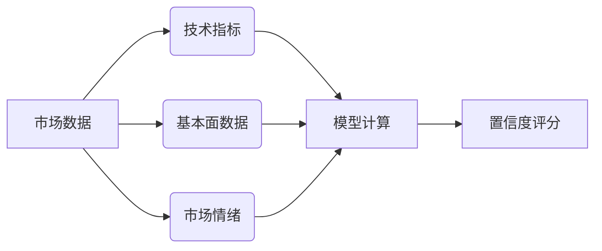

# 信号可信度（Confidence）使用规范

## 定义
`confidence`字段表示策略对当前信号的置信程度，取值范围为0.0（完全不确定）到1.0（完全确定）。

## 架构总览


## 评估体系



## 核心功能

### 1. 信号强度量化
- 0.0 ~ 0.3: 弱信号（观察区）
- 0.4 ~ 0.6: 中等信号（验证区）
- 0.7 ~ 1.0: 强信号（执行区）

### 2. 执行优先级控制
```python
# 执行引擎示例
if signal.confidence >= 0.8:
    execute_immediately(signal)
elif 0.6 <= signal.confidence < 0.8:
    validate_and_execute(signal)
else:
    log_signal(signal)
```

### 3. 风险管理
- 仓位计算：`position_size = base_size * confidence`
- 滑点容忍度：`slippage_tolerance = max_slippage * confidence`

### 4. 策略优化
- 高置信度信号优先参与回测
- 根据confidence分布评估策略稳定性

## 计算逻辑


## 最佳实践
1. 每个策略应定义最小执行confidence阈值（建议≥0.65）
2. 结合波动率调整动态confidence阈值
3. 定期校准confidence计算模型
4. 在回测报告中单独统计高confidence信号表现
5. 不同策略类型建议confidence基准值：
   - 趋势策略：0.7+
   - 套利策略：0.8+
   - 高频策略：0.6+

## 使用示例
```python
# 生成高置信度信号
high_confidence_signal = SignalEvent(
    timestamp=datetime.now(),
    strategy_id="arb_001",
    signal_type="BUY",
    parameters={"volume": 500},
    confidence=0.92  # 极高置信度
)

# 使用confidence控制执行
if high_confidence_signal.confidence > current_market_volatility * 0.8:
    execute_order(high_confidence_signal)
```

## 相关文档
- [策略信号规范](./signal_specification.md)
- [风险管理体系](./risk_management.md)
- [执行引擎原理](./execution_engine.md)
