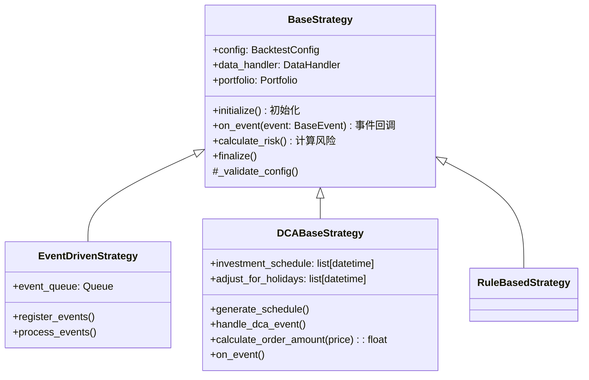

```mermaid
classDiagram
  class BaseStrategy {
          +config: BacktestConfig
          +data_handler: DataHandler
          +portfolio: Portfolio
          +initialize() 初始化
          +on_event(event: BaseEvent) 事件回调
          +calculate_risk() 计算风险
          +finalize() 
          #_validate_config()
      }

  class EventDrivenStrategy {
      +event_queue: Queue
      +register_events()
      +process_events()
  }
  class DCABaseStrategy {
      +investment_schedule: list[datetime]
      +generate_schedule()
      +handle_dca_event()
      +adjust_for_holidays: list[datetime]
      +calculate_order_amount(price): float
      +on_event()
  }
  class RuleBasedStrategy {

  }


  BaseStrategy <|-- EventDrivenStrategy
  BaseStrategy <|-- DCABaseStrategy
  BaseStrategy <|-- RuleBasedStrategy
```