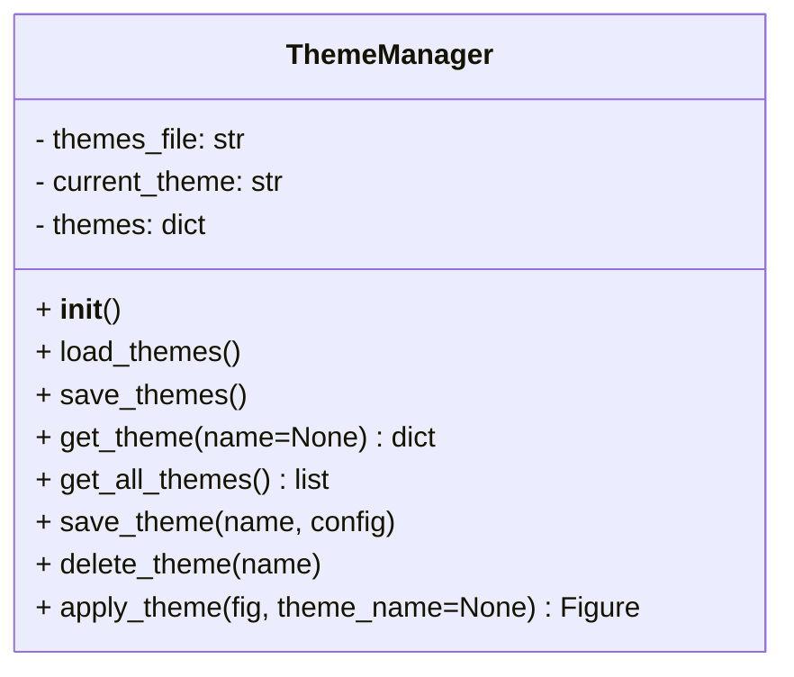
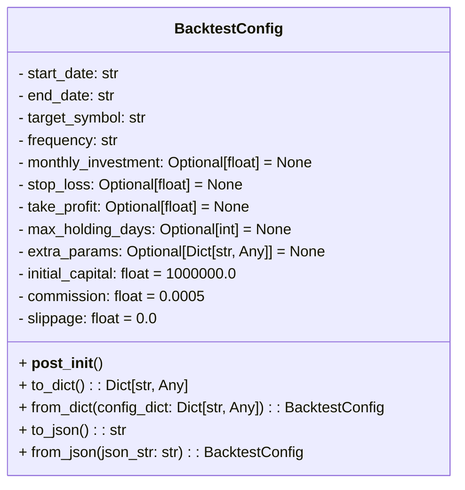
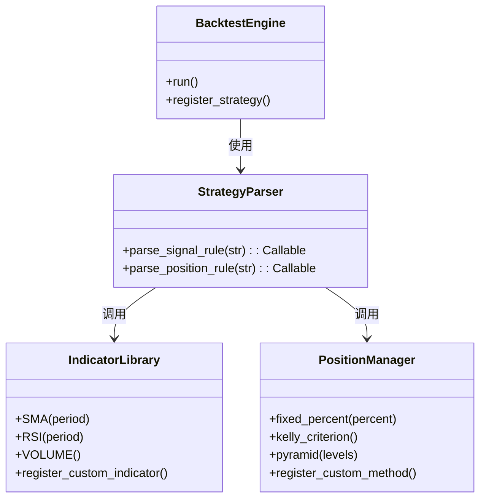

```mermaid
classDiagram
    class ThemeManager {
        - themes_file: str
        - current_theme: str
        - themes: dict
        + __init__()
        + load_themes()
        + save_themes()
        + get_theme(name=None) dict
        + get_all_themes() list
        + save_theme(name, config)
        + delete_theme(name)
        + apply_theme(fig, theme_name=None) Figure
    }
```

```mermaid
classDiagram
  class BacktestConfig {
    - start_date: str
    - end_date: str
    - target_symbol: str
    - frequency: str
    - monthly_investment: Optional[float] = None
    - stop_loss: Optional[float] = None
    - take_profit: Optional[float] = None
    - max_holding_days: Optional[int] = None
    - extra_params: Optional[Dict[str, Any]] = None
    - initial_capital: float = 1000000.0
    - commission: float = 0.0005
    - slippage: float = 0.0
    + __post_init__()
    + to_dict(): Dict[str, Any]
    + from_dict(config_dict: Dict[str, Any]): BacktestConfig
    + to_json(): str
    + from_json(json_str: str): BacktestConfig
  }

  
```
# not reviewed

```mermaid
classDiagram
    class BacktestEngine {
        +run()
        +register_strategy()
    }
    
    class StrategyParser {
        +parse_signal_rule(str) : Callable
        +parse_position_rule(str) : Callable
    }
    
    class IndicatorLibrary {
        +SMA(period)
        +RSI(period)
        +VOLUME()
        +register_custom_indicator()
    }
    
    class PositionManager {
        +fixed_percent(percent)
        +kelly_criterion()
        +pyramid(levels)
        +register_custom_method()
    }
    
    BacktestEngine --> StrategyParser : 使用
    StrategyParser --> IndicatorLibrary : 调用
    StrategyParser --> PositionManager : 调用
```