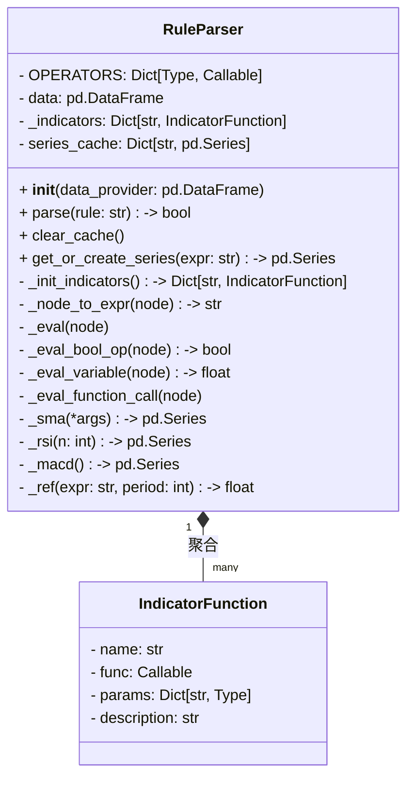

```mermaid
classDiagram
  class RuleParser {
    - OPERATORS: Dict[Type, Callable]
    - data: pd.DataFrame
    - _indicators: Dict[str, IndicatorFunction]
    - series_cache: Dict[str, pd.Series]
    + __init__(data_provider: pd.DataFrame)
    + parse(rule: str) -> bool
    + clear_cache()
    + get_or_create_series(expr: str) -> pd.Series
    - _init_indicators() -> Dict[str, IndicatorFunction]
    - _node_to_expr(node) -> str
    - _eval(node)
    - _eval_bool_op(node) -> bool
    - _eval_variable(node) -> float
    - _eval_function_call(node)
    - _sma(*args) -> pd.Series
    - _rsi(n: int) -> pd.Series
    - _macd() -> pd.Series
    - _ref(expr: str, period: int) -> float
  }

  class IndicatorFunction {
    - name: str
    - func: Callable
    - params: Dict[str, Type]
    - description: str
  }

  RuleParser "1" *-- "many" IndicatorFunction : 聚合
```

