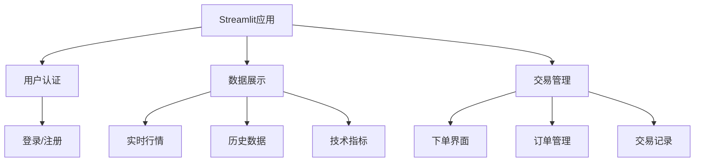

# 前端设计方案

## 技术选型
- 前端框架：Streamlit
- 图表库：Streamlit内置图表 + Plotly
- 状态管理：Session State
- 样式：Streamlit主题 + 自定义CSS

## 页面结构

## 主要功能模块
1. 用户认证
   - 登录/注册功能
   - 权限管理

2. 数据展示
   - 实时行情
   - 历史数据
   - 技术指标分析

3. 交易管理
   - 下单界面
   - 订单管理
   - 交易记录查看

## 开发规范
1. 使用st.sidebar创建侧边栏
2. 利用st.columns进行页面布局
3. 使用st.cache优化性能
4. 通过Session State管理用户状态
5. 遵循PEP8代码规范
