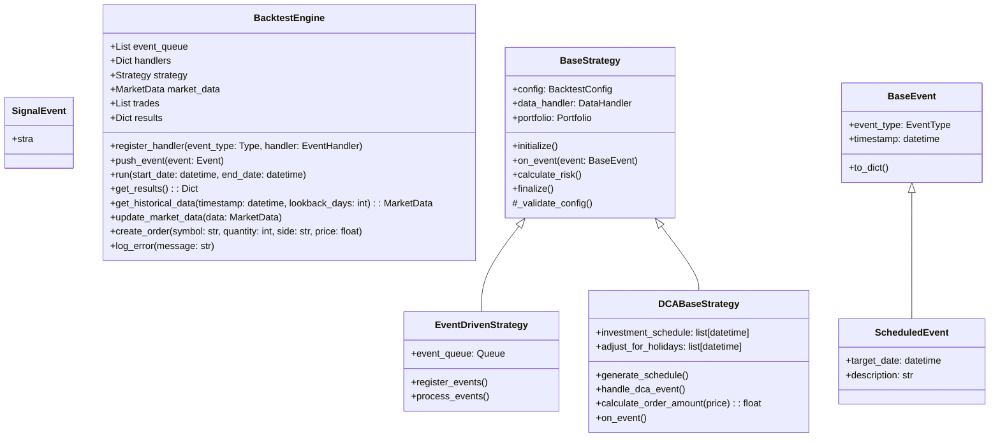

```mermaid
classDiagram
    class SignalEvent {
      +stra
    }

    class BacktestEngine {
        +List<Event> event_queue
        +Dict<Type~EventHandler> handlers
        +Strategy strategy
        +MarketData market_data
        +List<Trade> trades
        +Dict results
        +register_handler(event_type: Type, handler: EventHandler)
        +push_event(event: Event)
        +run(start_date: datetime, end_date: datetime)
        +get_results() : Dict
        +get_historical_data(timestamp: datetime, lookback_days: int) : MarketData
        +update_market_data(data: MarketData)
        +create_order(symbol: str, quantity: int, side: str, price: float)
        +log_error(message: str)
    }

    class BaseStrategy {
        +config: BacktestConfig
        +data_handler: DataHandler
        +portfolio: Portfolio
        +initialize()
        +on_event(event: BaseEvent)
        +calculate_risk()
        +finalize()
        #_validate_config()
    }
    class BaseEvent {
        +event_type: EventType
        +timestamp: datetime
        +to_dict()
    }
    class ScheduledEvent {
        +target_date: datetime
        +description: str
    }
    class EventDrivenStrategy {
        +event_queue: Queue
        +register_events()
        +process_events()
    }
    class DCABaseStrategy {
        +investment_schedule: list[datetime]
        +generate_schedule()
        +handle_dca_event()
        +adjust_for_holidays: list[datetime]
        +calculate_order_amount(price): float
        +on_event()
    }

    BaseStrategy <|-- EventDrivenStrategy
    BaseStrategy <|-- DCABaseStrategy
    BaseEvent <|-- ScheduledEvent

```