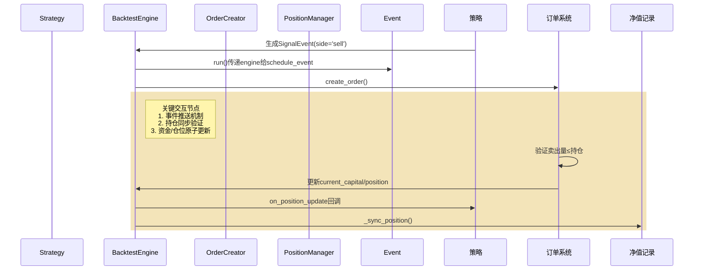

```mermaid
sequenceDiagram
    participant Strategy
    participant BacktestEngine
    participant OrderCreator
    participant PositionManager
    participant Event

    策略->>BacktestEngine: 生成SignalEvent(side='sell')
    BacktestEngine->>Event: run()传递engine给schedule_event
    BacktestEngine->>订单系统: create_order()
    
    rect rgba(214, 167, 26, 0.3)
        note right of BacktestEngine: 关键交互节点<br/>1. 事件推送机制<br/>2. 持仓同步验证<br/>3. 资金/仓位原子更新
        
        订单系统->>订单系统: 验证卖出量≤持仓
        订单系统->>BacktestEngine: 更新current_capital/position
        BacktestEngine->>策略: on_position_update回调
        
        BacktestEngine->>净值记录: _sync_position()
    end
```